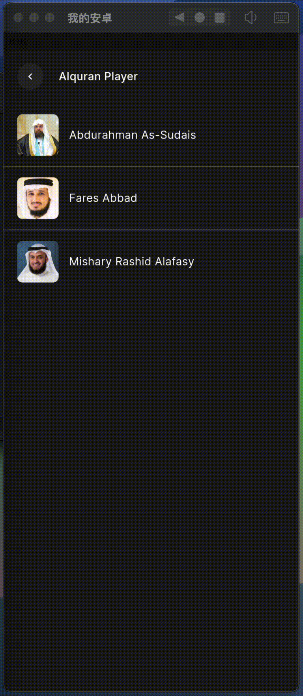

## Tech Stack
- State Management: GetX
- Audio Player: Just Audio
- API / HTTP Fetch: Dio

## Penjelasan Folder
note: folder yang dijelaskan ada dalam lingkup folder `lib`

**Ringkasan `lib`**
- **Tujuan**: Folder `lib` berisi seluruh kode sumber aplikasi Flutter (UI, logic, routing, dan akses data).

**File Utama**
- `main.dart`: Titik masuk aplikasi yang memanggil `runApp`.
- `app.dart`: Konfigurasi `GetMaterialApp` (theme, routes, initialBinding, initialRoute).

**Folder: `core/`** (konfigurasi dan utilitas aplikasI)
- `models/`: Model-domain yang dipakai lintas fitur (contoh: `status.dart`).
- `routes/`: Routing dan dependency bindings global (`bindings.dart`, `routes.dart`).
- `theme/`: Konstanta tema dan helper (`theme_color.dart`, `theme_radius.dart`, `theme_text.dart`).
- `utils/`: Helper/extension umum (`extensions.dart`).
- `widgets/`: Komponen UI reusable (`w_appbar.dart`, `w_refresher.dart`, `w_wrapper.dart`).

**Folder: `feature/`** (fitur modular)
- `quran/`: Semua kode terkait fitur Quran.
	- `quran_routes.dart`: Route khusus fitur Quran.
	- `controllers/`: Controller/state per layar (mis. `c_quran_main`, `c_quran_player`, `c_quran_surah`).
	- `views/`: UI layar per fitur (mis. `v_quran_main`, `v_quran_player`, `v_quran_surah`).
	- `widgets/`: Widget spesifik fitur (mis. `w_reciter_tile.dart`, `w_surah_tile.dart`).

**Folder: `repository/`** (lapisan akses data)
- `r_quran/`: Repository untuk data Quran.
	- `r_quran.dart`: Implementasi fetch/transform data untuk fitur Quran.
	- `models/`: Model data repository (mis. `reciter_model`, `surah_model`).


## Cara Menjalankan

**Prasyarat**
- Pastikan `Flutter SDK` terpasang dan tersedia di `PATH`.
- Untuk Android: Android SDK + device/emulator; untuk iOS: macOS + Xcode.

**Langkah singkat**
- Install dependency:

```
flutter pub get
```

- Menjalankan aplikasi pada device/emulator terhubung:

```
flutter run
```

- Menjalankan pada device tertentu (contoh: Android emulator atau iOS simulator):

```
flutter run -d <device_id>
```

- Build release (Android APK):

```
flutter build apk --release
```

- Build release (iOS — butuh macOS + Xcode):

```
flutter build ios --release
```

**Tips bila ada masalah**
- Jalankan `flutter clean` lalu `flutter pub get` jika terjadi masalah dependency atau plugin native.
- Periksa device/emulator dengan `flutter devices`.
- Buka proyek di VS Code atau Android Studio untuk debugging/Hot Reload lebih nyaman.

## Modifikasi UI

UI durasi yang ditampilkan di List Surah diganti menjadi chevron dikarenakan keterbatasan API yang tidak menyertakan durasi pada endpoint `https://api.alquran.cloud/v1/surah`

## Screenshot
<div style="display:flex; flex-wrap:wrap; gap:10px;">
  
  
  
</div>

